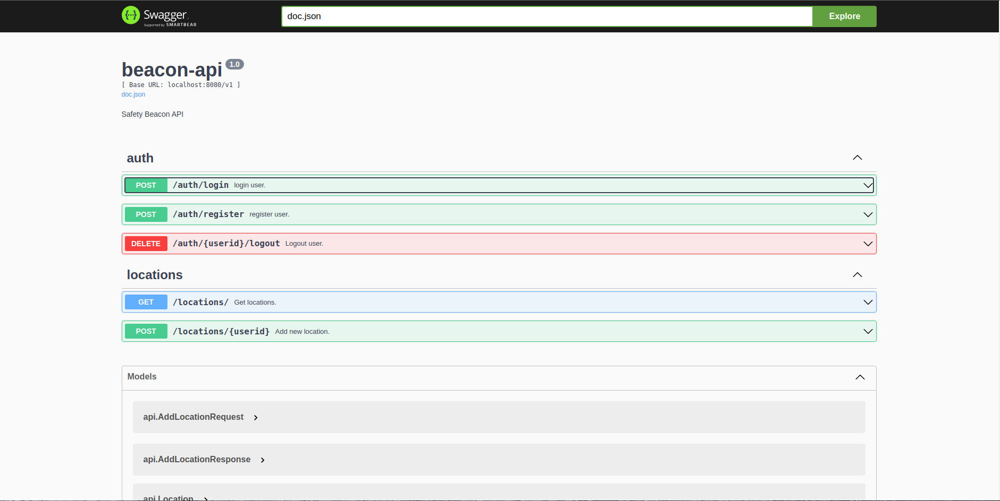

# beacon-api


## Quick Start 

```bash
export POSTGRES_USER=<value>
export POSTGRES_PASSWORD=<value>
export POSTGRES_DATABASE=<value>
export POSTGRES_HOST=<value>
export PORT=<value>
```

```bash
go build -o server cmd/main.go
```

```bash
./server
```

## Swagger docs

you can find swagger docs on

```
http://localhost:<port>/v1/swagger/index.html
```




## Docker

```bash
docker build -t beacon-api:v1 .
```


### NOTE:

- You can specify some environment variables when building the image (in
Dockerfile), Or you can use `-e` flag to specify the key and value when running
the image.

- If you are going to use docker-compose you can add the environment variables in
`environment`.

- If you are going to use the image with k8s pod you just need to add as well the
env vars under the container specs -> environment.

```bash
docker run -p 8080:8080 --network=host beacon-api:v1
```
